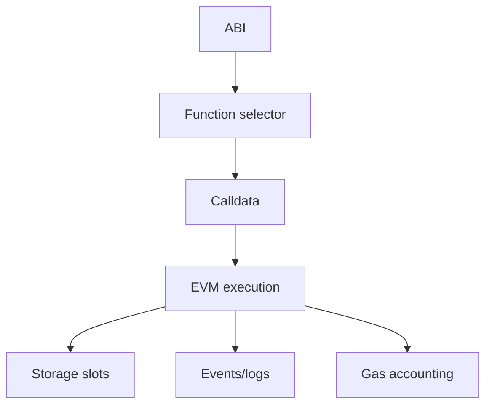

# evm-foundations

An educational Foundry project for learning Ethereum internals, the EVM, ABI encoding,
bytecode, storage, memory, calldata, gas, transactions, blocks, state, and RPC workflows.

## Learning Goal

Understand how an Ethereum transaction moves from a signed payload to EVM execution,
state changes, logs, gas accounting, and a final transaction receipt.



## Repository Structure

```text
evm-foundations/
|-- foundry.toml
|-- Makefile
|-- README.md
|-- notes/
|   |-- 01-transaction-lifecycle.md
|   |-- 02-abi-selectors-calldata.md
|   |-- 03-storage-memory-calldata.md
|   |-- 04-gas-and-attack-surface.md
|   `-- lab-foundry-cast.md
|-- script/
|   `-- Deploy.s.sol
|-- src/
|   |-- Counter.sol
|   |-- EventLogger.sol
|   |-- PaymentSplitter.sol
|   `-- SimpleStorage.sol
`-- test/
    |-- Counter.t.sol
    |-- EventLogger.t.sol
    |-- PaymentSplitter.t.sol
    `-- SimpleStorage.t.sol
```

## File Guide

| File | What It Does | Expected Behavior | Required Structure And Elements |
| --- | --- | --- | --- |
| `README.md` | Explains the project, learning path, commands, files, and expected outcomes. | A new reader should understand what to run, what each file is for, and what concepts the project teaches. | Project goal, architecture diagram, setup commands, local Anvil workflow, exercises, file guide, and external resources. |
| `foundry.toml` | Configures Foundry. | `forge build`, `forge test`, and `forge fmt` use the same source, output, test, script, compiler, optimizer, and formatting settings. | `[profile.default]` with `src`, `out`, `libs`, `test`, `script`, `solc_version`, optimizer settings, plus `[fmt]` formatting rules. |
| `Makefile` | Provides shortcuts for common Foundry and Cast commands. | `make build`, `make test`, `make gas`, `make abi`, `make selectors`, and local RPC helpers call the correct underlying tools. | Configurable variables such as `RPC_URL`, `PRIVATE_KEY`, `COUNTER`, and `SIMPLE_STORAGE`, plus `.PHONY` targets for repeatable commands. |
| `.gitignore` | Keeps generated files and local secrets out of version control. | Foundry build artifacts, broadcast logs, coverage output, and `.env` files are ignored. | Entries for `out/`, `cache/`, `broadcast/`, `coverage/`, `lcov.info`, `.env`, and existing language/tool artifacts. |
| `src/Counter.sol` | A minimal state-changing contract for ABI, selector, calldata, event, revert, and gas inspection. | `number` starts from the constructor value, changes through `setNumber`, `increment`, `decrement`, and `reset`, emits `NumberChanged`, and reverts on underflow. | SPDX license, pragma, `number` state variable, `NumberChanged` event, `CounterUnderflow` error, constructor, state-changing functions, selector helper, and calldata echo helper. |
| `src/SimpleStorage.sol` | Demonstrates simple storage slots, dynamic arrays, mappings, and data locations. | Simple variables occupy predictable slots, array length lives in slot `3`, mapping seed lives in slot `4`, and calldata can be copied into mutable memory. | SPDX license, pragma, fixed slot variables, dynamic array, mapping, events, setter functions, array and mapping writers, calldata/memory comparison, storage reader, and slot summary helper. |
| `src/EventLogger.sol` | Focuses on logs, indexed event topics, `receive`, and `fallback`. | Calls emit events, update `totalLogs`, remember the latest topic and message, and record direct ETH transfers or unknown calldata through logs. | SPDX license, pragma, log state variables, indexed events, normal logging functions, payable logging function, `receive`, `fallback`, and a private state update helper. |
| `src/PaymentSplitter.sol` | An educational ETH splitter for accounting, storage, external calls, gas, and attack surface analysis. | Payees receive ETH pro rata by shares, released amounts are tracked, duplicate or invalid payees revert, and state is updated before ETH transfer. | SPDX license, pragma, share and release accounting, payee list, mappings, events, custom errors, constructor validation, `receive`, view helpers, `releasable`, `release`, and private payee registration. |
| `script/Deploy.s.sol` | Deploys all contracts to a local or configured network. | `forge script ... --broadcast` deploys `Counter`, `SimpleStorage`, `EventLogger`, and `EducationalPaymentSplitter`, then returns their addresses. | Contract imports, a minimal `Vm` interface for Foundry cheatcodes, environment-variable payee defaults, `startBroadcast`, contract creation, and `stopBroadcast`. |
| `test/Counter.t.sol` | Tests the counter contract without external test libraries. | Constructor value, selector calculation, state updates, revert data, and calldata echo behavior are checked with plain Solidity `assert`. | Contract import, test contract, functions named with `test`, direct calls, low-level call for revert inspection, and assertions. |
| `test/SimpleStorage.t.sol` | Tests storage layout assumptions and data-location behavior. | Slot summary values match the documented layout, setters update state, array and mapping writes work, and memory mutation does not change calldata. | Contract import, test contract, storage summary assertions, setter assertions, array/mapping checks, calldata/memory comparison, and sum check. |
| `test/EventLogger.t.sol` | Tests event logger state changes and payable entry points. | Logging updates metadata, direct ETH transfer triggers `receive`, unknown calldata triggers `fallback`, and `totalLogs` increments. | Contract import, test contract, topic hashing, log assertions, low-level payable calls, fallback call, and state assertions. |
| `test/PaymentSplitter.t.sol` | Tests share accounting and ETH release behavior. | Payees and shares are stored, funded ETH is split according to shares, releases update balances, and unknown accounts revert. | Receiver helper contract, splitter setup helper, payee/share assertions, funding call, balance delta checks, low-level revert inspection, and assertions. |
| `notes/01-transaction-lifecycle.md` | Describes the transaction lifecycle from signing to receipt. | Readers should be able to explain validation, mempool propagation, block inclusion, execution, gas charging, logs, and finality. | Step-by-step lifecycle, important transaction fields, and Anvil/Cast commands. |
| `notes/02-abi-selectors-calldata.md` | Explains ABI encoding, function selectors, calldata, calls, and transactions. | Readers can inspect ABI output, calculate selectors, encode calldata, distinguish `cast call` from `cast send`, and query a deployed contract. | Selector formula, `forge inspect` commands, `cast sig`, `cast calldata`, `cast call`, and `cast send` examples. |
| `notes/03-storage-memory-calldata.md` | Explains persistent storage, temporary memory, read-only calldata, and slot inspection. | Readers can read simple slots, reason about dynamic array slots, compute mapping slots, and compare data locations. | Data-location definitions, documented `SimpleStorage` slot layout, `cast storage`, `cast keccak`, and `cast index` examples. |
| `notes/04-gas-and-attack-surface.md` | Connects gas costs with design and security thinking. | Readers can identify expensive storage writes, calldata costs, event tradeoffs, loop risks, external call risks, and state-before-call accounting. | Gas observations, Foundry gas commands, and review questions for contract design. |
| `notes/lab-foundry-cast.md` | Provides the hands-on local lab. | Readers can build, test, run Anvil, deploy contracts, inspect ABI, calculate selectors, make calls, send transactions, read storage, and compare opcodes. | Foundry commands, Anvil setup, environment variables, deployment command, contract address variables, Cast exercises, and opcode practice. |

## Contracts

- `Counter`: selectors, simple calldata, events, custom errors, and state changes.
- `SimpleStorage`: simple slots, a dynamic array, a mapping, `storage`, `memory`, and `calldata`.
- `EventLogger`: events, indexed topics, `receive`, and `fallback`.
- `EducationalPaymentSplitter`: ETH splitting, accounting, storage writes, external calls, gas, and attack surface.

## Setup

Install Foundry from the official site:

```text
https://www.getfoundry.sh/
```

Then run:

```bash
forge build
forge test
forge test --gas-report
```

## Local Lab

Terminal 1:

```bash
anvil
```

Terminal 2:

```bash
export RPC_URL=http://127.0.0.1:8545
export PRIVATE_KEY=<ANVIL_PRIVATE_KEY>
export PAYEE_ONE=<ANVIL_ACCOUNT_ONE>
export PAYEE_TWO=<ANVIL_ACCOUNT_TWO>

cast block latest --rpc-url $RPC_URL
forge script script/Deploy.s.sol:Deploy --rpc-url $RPC_URL --private-key $PRIVATE_KEY --broadcast
```

Copy the deployed addresses from the deployment output:

```bash
export COUNTER=<DEPLOYED_COUNTER_ADDRESS>
export SIMPLE_STORAGE=<DEPLOYED_SIMPLE_STORAGE_ADDRESS>
export LOGGER=<DEPLOYED_EVENT_LOGGER_ADDRESS>
export SPLITTER=<DEPLOYED_SPLITTER_ADDRESS>
```

## Exercises

Inspect the ABI:

```bash
forge inspect Counter abi
forge inspect SimpleStorage abi
forge inspect EventLogger abi
forge inspect EducationalPaymentSplitter abi
```

Calculate function selectors and calldata:

```bash
cast sig "increment()"
cast sig "setNumber(uint256)"
cast calldata "setNumber(uint256)" 123
```

Make a local read-only call:

```bash
cast call $COUNTER "number()(uint256)" --rpc-url $RPC_URL
```

Send a local transaction:

```bash
cast send $COUNTER "increment()" --rpc-url $RPC_URL --private-key $PRIVATE_KEY
cast call $COUNTER "number()(uint256)" --rpc-url $RPC_URL
```

Read storage:

```bash
cast send $SIMPLE_STORAGE "setValue(uint256)" 777 --rpc-url $RPC_URL --private-key $PRIVATE_KEY
cast storage $SIMPLE_STORAGE 0 --rpc-url $RPC_URL
```

Compare `storage`, `memory`, and `calldata`:

```bash
cast call $SIMPLE_STORAGE "compareCalldataAndMemory(uint256[])(uint256,uint256,uint256)" "[5,6]" --rpc-url $RPC_URL
```

Use the notes as the guided path:

- `notes/01-transaction-lifecycle.md`
- `notes/02-abi-selectors-calldata.md`
- `notes/03-storage-memory-calldata.md`
- `notes/04-gas-and-attack-surface.md`
- `notes/lab-foundry-cast.md`

## External Resources

- Ethereum Developer Docs: https://ethereum.org/developers/docs/
- Ethereum Transactions: https://ethereum.org/developers/docs/transactions/
- Ethereum Whitepaper: https://ethereum.org/en/whitepaper/
- Solidity Documentation: https://docs.soliditylang.org/en/latest/
- Solidity Internals: https://docs.soliditylang.org/en/latest/internals/
- Foundry: https://www.getfoundry.sh/
- EVM Codes: https://www.evm.codes/

## Expected Outcome

After completing the exercises, you should be able to:

- Explain the lifecycle of an Ethereum transaction.
- Describe what the ABI does and how function selectors are calculated.
- Read simple storage slots with `cast storage`.
- Use Foundry and Cast without depending on a step-by-step tutorial.
- Connect gas costs to contract design decisions.
- Start identifying attack surface around storage writes, external calls, loops, and ETH transfers.
